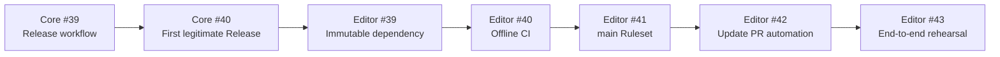

# Reliable Core Releases & Editor Dependency Delivery

**Status:** accepted design; implementation not authorized by this document

**Date:** 2026-07-23

**Program Epic:** [editor-assistant#38](https://github.com/lanmogu98/editor-assistant/issues/38)

**GitHub Project:** [Reliable Core Releases & Editor Dependency Delivery](https://github.com/users/lanmogu98/projects/11)

## Purpose

Create a reproducible cross-repository delivery path in which `llm-exec-core`
publishes validated Python artifacts through GitHub Releases and
`editor-assistant` consumes, tests, and proposes upgrades to those immutable
artifacts without following the Core `main` branch.

This is a planning contract. Creating the Project, Epic, child Issues, and this
document does not authorize workflow implementation, repository-setting
changes, releases, pull requests, merges, secrets, bypasses, or direct updates
to `main`. Each implementation Issue requires a later explicit dispatch.

## Current state and problem

- `llm-exec-core` is currently version `0.4.1` and already has an offline CI
  workflow for Python 3.10 and 3.13, but no automated GitHub Release workflow.
- `editor-assistant` declares `llm-exec-core>=0.4.1,<0.5.0`, then overrides it
  with an editable sibling path in `[tool.uv.sources]`:
  `../llm-exec-core`.
- A clean Editor checkout therefore cannot reproduce the dependency without a
  particular local directory layout.
- Editor has no CI workflow and no active `main` protection tied to real check
  names.
- Core changes frequently enough that relying on a maintainer to notice every
  Release and edit Editor manually is not a dependable update mechanism.

## Accepted decisions

1. Publish Core distributions through GitHub Releases, not PyPI.
2. Build wheel and sdist from an exact versioned source commit and tag.
3. Editor consumes an immutable Release wheel URL and never follows Core
   `main`.
4. Stable releases below `0.5.0` are eligible for routine update PRs.
5. `0.5.0` and later require an explicit compatibility assessment and are not
   adopted automatically.
6. Generated dependency PRs never auto-merge.
7. Required Editor CI is offline and uses no provider API keys or paid LLM
   calls.
8. Editor `main` uses a solo-maintainer-friendly Ruleset: PR required, zero
   approvals required, real checks required and current, conversations
   resolved, force pushes and deletion blocked, and no default administrator
   bypass.

## Program structure and dependency order

The GitHub Project contains the Epic plus seven implementation/validation
contracts. Its numeric `Sequence` field is persisted and sorted ascending.

| Sequence | Repository | Contract | Depends on | Required result |
|---:|---|---|---|---|
| 0 | Editor | [Epic #38](https://github.com/lanmogu98/editor-assistant/issues/38) | — | Program coordination and final acceptance |
| 1 | Core | [#39](https://github.com/lanmogu98/llm-exec-core/issues/39) | Existing Core CI | Controlled, validated Release workflow |
| 2 | Core | [#40](https://github.com/lanmogu98/llm-exec-core/issues/40) | Core #39 | First legitimate workflow-produced stable Release |
| 3 | Editor | [#39](https://github.com/lanmogu98/editor-assistant/issues/39) | Core #40 | Immutable Release dependency and regenerated lock |
| 4 | Editor | [#40](https://github.com/lanmogu98/editor-assistant/issues/40) | Editor #39 | Stable quality and Python compatibility checks |
| 5 | Editor | [#41](https://github.com/lanmogu98/editor-assistant/issues/41) | Editor #40 | Active `main` Ruleset using observed check names |
| 6 | Editor | [#42](https://github.com/lanmogu98/editor-assistant/issues/42) | Editor #41 | Compatible-Release updater that opens CI-gated PRs |
| 7 | Editor | [#43](https://github.com/lanmogu98/editor-assistant/issues/43) | Editor #42 | Recorded end-to-end production rehearsal |



No child starts before its predecessor is complete. The Epic closes only after
the sequence-7 rehearsal has passed and its evidence is recorded.

## Architecture

### 1. Core Release workflow

Core #39 adds one controlled Release workflow, expected at
`.github/workflows/release.yml`.

The workflow is manually dispatched with an exact version and a dry-run/publish
mode. It must:

1. run only against the intended `main` commit;
2. require the input version to equal `project.version` in `pyproject.toml`;
3. require the corresponding `vX.Y.Z` tag and public Release not to exist;
4. run the canonical locked CI gates already used by Core;
5. build wheel and sdist with `uv build`;
6. install the built wheel in clean Python 3.10 and 3.13 environments and run
   a minimal import/version smoke test;
7. generate a `SHA256SUMS` file for both distributions;
8. in dry-run mode, upload only workflow artifacts and create no tag or
   Release; and
9. in publish mode, create the exact tag, stage a draft Release, upload the
   wheel, sdist, and checksums, then publish only after every preceding gate
   succeeds.

The workflow uses concurrency control to prevent overlapping releases. Actions
are pinned to immutable commit SHAs. Default permissions are read-only;
`contents: write` is scoped only to the publishing job.

Release assets are append-only from the program's perspective. A bad public
artifact is never overwritten under an existing tag. It is documented and
superseded by a new patch Release.

Core #39 proves the workflow in dry-run mode but does not invent a stable
version merely to finish the Issue. Core #40 performs the next legitimate
stable Release after the change set and version are independently justified.

### 2. Immutable Editor dependency

Editor #39 removes the editable sibling source and replaces the dependency with
a standard PEP 508 direct reference to the validated wheel, for example:

```toml
"llm-exec-core @ https://github.com/lanmogu98/llm-exec-core/releases/download/vX.Y.Z/llm_exec_core-X.Y.Z-py3-none-any.whl"
```

`uv.lock` is regenerated and committed. The Release tag, wheel filename,
package metadata version, and locked artifact hash must agree.

A direct reference is already an exact pin, so PEP 508 does not combine it with
`<0.5.0` on the same requirement. The `0.5.0` ceiling is instead a hard policy
gate in the updater: it may rewrite the exact URL only when the candidate
version is stable and `<0.5.0`. Before updater automation exists, the exact URL
itself prevents unplanned movement.

Acceptance requires both `uv` and ordinary `pip` installation from a clean
checkout without a sibling Core repository, on Python 3.10 and 3.13.

### 3. Editor CI contract

Editor #40 adds `.github/workflows/ci.yml`, triggered for every pull request to
`main`, every push to `main`, and manual dispatch. It has no path filters and
uses read-only permissions.

The required check names are stable contracts:

- `Quality`
- `Unit tests (Python 3.10)`
- `Unit tests (Python 3.13)`

`Quality` runs on Python 3.13 and checks Black formatting, Flake8 linting, and
mypy typing using the repository's documented scopes. Unit jobs run only
`tests/unit/` with the frozen lockfile. Integration tests, provider credentials,
network LLM calls, and paid calls are excluded.

If the existing baseline fails one of these commands, Editor #40 fixes only a
small blocker that is directly necessary to establish the check. Larger cleanup
is split into a focused follow-up Issue rather than hidden inside CI work.

### 4. `main` Ruleset

Editor #41 creates an active Ruleset named `Protect main` only after #40 has
produced real check runs. It targets `main` and requires:

- changes through a pull request;
- zero required approvals;
- all review conversations resolved;
- the exact three checks above;
- the branch to be current with `main` before merge;
- no force pushes; and
- no branch deletion.

There is no default administrator bypass. Signed commits, linear history,
deployment gates, and unrelated restrictions are out of scope.

### 5. Compatible Release updater

Editor #42 adds `.github/workflows/update-llm-exec-core.yml`, scheduled daily and
available through `workflow_dispatch`.

For each run it:

1. queries public Releases in `lanmogu98/llm-exec-core`;
2. ignores drafts, prereleases, invalid tags, and Releases missing the expected
   wheel or checksum evidence;
3. determines the exact currently pinned Core version from `pyproject.toml`;
4. selects only a newer stable candidate below `0.5.0`;
5. verifies that Release/tag/artifact versions and the published SHA256 entry
   agree;
6. updates the direct wheel URL and regenerates `uv.lock`;
7. reuses one deterministic branch/PR for the candidate version; and
8. includes old/new versions, Release notes, Release URL, artifact URL, and
   checksum evidence in the PR body.

Runs are idempotent. Repeating a run does not create duplicate PRs or duplicate
assessment Issues. The workflow never enables auto-merge.

For `0.5.0+`, the updater changes neither `pyproject.toml` nor `uv.lock`. It
creates or updates one version-keyed compatibility-assessment Issue instead.

The preferred credential is the repository-scoped `GITHUB_TOKEN`; no long-lived
PAT is introduced by default. Because events created by `GITHUB_TOKEN` generally
do not start another workflow, merely opening the PR is insufficient. The
implementation must use and prove a secure explicit handoff, such as dispatching
the CI workflow on the generated branch, so all three required check names are
attached to the PR head commit. If that cannot be demonstrated, #42 remains
blocked rather than weakening the Ruleset.

### 6. End-to-end rehearsal

Editor #43 uses the next legitimate compatible Core Release and records:

- Core Release workflow run, tag, Release, assets, and checksums;
- updater run and generated Editor PR;
- all three required checks on the PR head;
- observed Ruleset refusal while a required check is absent/failing;
- manual merge after all requirements pass;
- the merge commit and green post-merge `main` run; and
- a rollback-through-PR path to the previous validated Release.

The `0.5.0+` branch is rehearsed with read-only/dry-run fixture input. The
program does not publish a fake stable Release merely to complete validation.

## Failure and rollback semantics

- Missing or inconsistent Core metadata, assets, or hashes fails closed before
  publication or before an Editor PR is opened.
- A failed Core publish attempt may leave a draft for controlled inspection,
  but never a partially published stable Release.
- Closing a generated Editor PR leaves the current dependency unchanged.
- Editor rollback pins the immediately preceding validated wheel and lockfile
  through the same PR, CI, and Ruleset path.
- Direct `main` pushes, Ruleset bypasses, tag reuse, and asset replacement are
  never recovery mechanisms.

## Security boundaries

- No provider API keys or paid service credentials enter CI.
- Workflow permissions are explicit and minimal at job level.
- Third-party Actions are pinned to immutable commits.
- Release discovery is read-only against a public repository.
- Only the updater job receives the permissions needed to write its branch,
  PR, or assessment Issue.
- No PAT is added unless a later focused design demonstrates that the accepted
  repository-token path cannot meet the CI-trigger contract and the maintainer
  separately approves the secret.

## Non-goals

- Publishing Core to PyPI.
- Tracking Core `main`, a floating branch, or an unversioned asset.
- Automatically merging dependency updates.
- Running live integration/provider tests in required CI.
- Expanding into Core catalog, schema, pricing, or execution-boundary work.
- Adding signed-commit or linear-history mandates.
- Implementing any workflow as part of this design-document change.

## Program completion criteria

The program is complete only when all seven child contracts close in sequence,
the end-to-end evidence is recorded in Editor #43, and the Epic acceptance
checklist is satisfied. Until then, the Project remains the coordination
surface and the individual Issue is the implementation authority for its own
bounded step.

## External references

- [GitHub: About releases](https://docs.github.com/en/repositories/releasing-projects-on-github/about-releases)
- [GitHub: `GITHUB_TOKEN` event behavior](https://docs.github.com/en/actions/concepts/security/github_token)
- [uv: Project dependencies and direct sources](https://docs.astral.sh/uv/concepts/projects/dependencies/)
